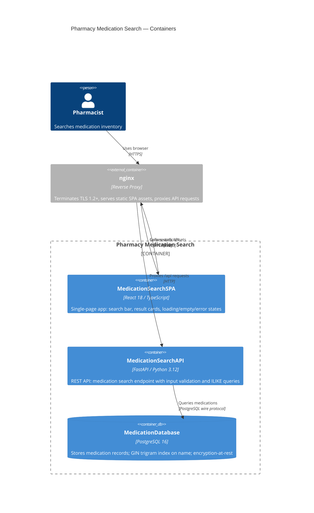
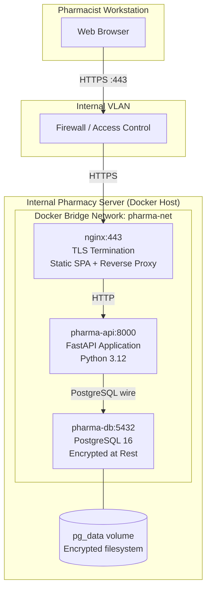
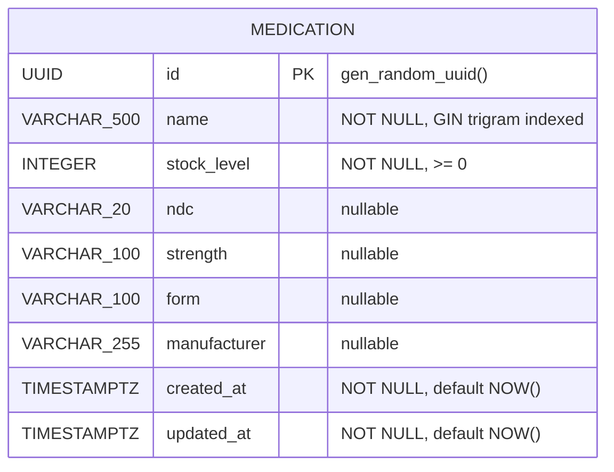
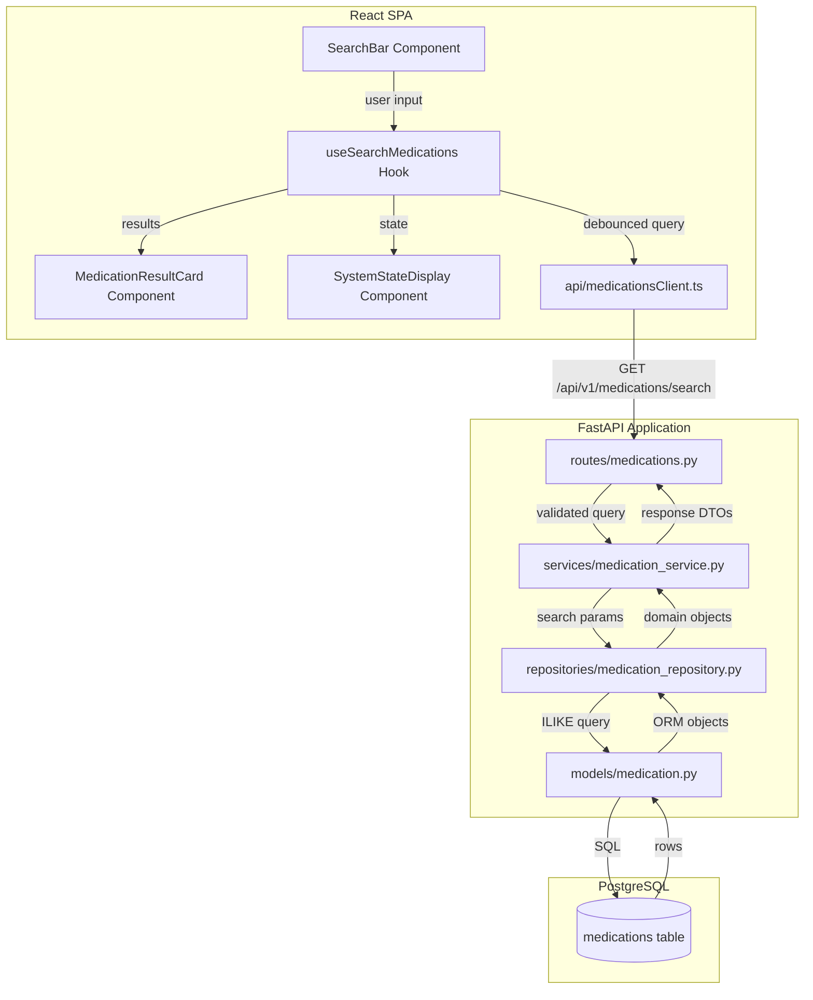
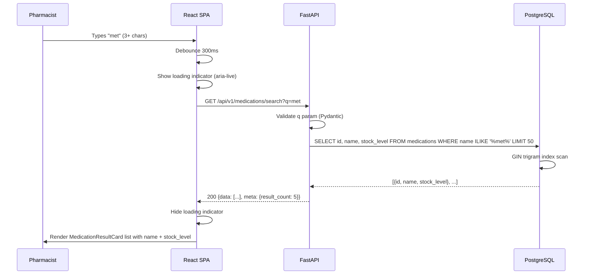
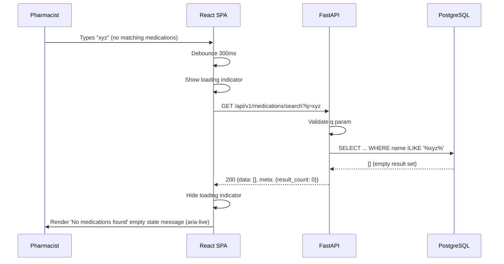
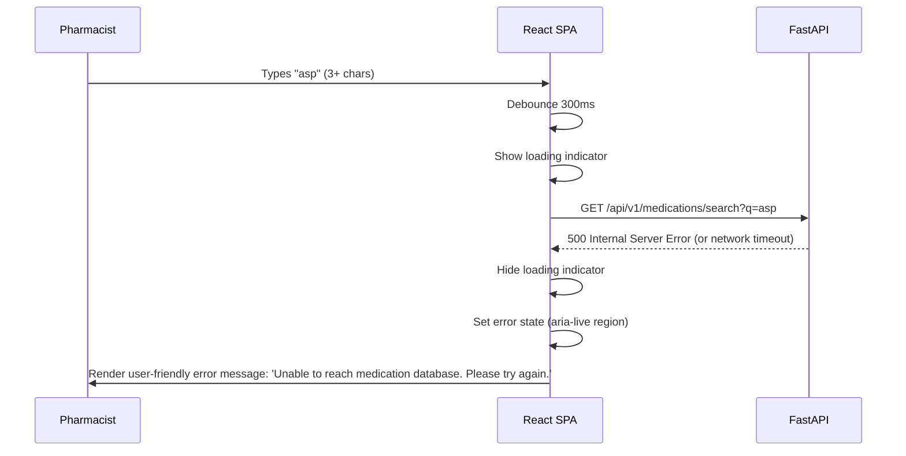
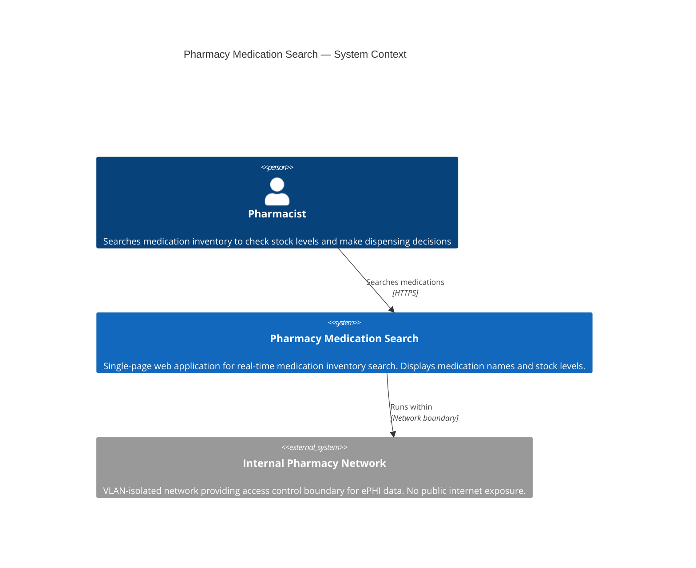

# Architecture Diagrams — Pharmacy Inventory Search

> Generated by Elite AI Pod's Solution Architect agent on 2026-08-20T11:56+00:00.
> Mermaid diagrams render natively on GitHub.

## Pharmacy Medication Search — Container Diagram (C4 Level 2)

Shows the three main containers: the React SPA served to the pharmacist's browser, the FastAPI backend processing search requests, and the PostgreSQL database storing encrypted medication records. All communication uses HTTPS/TLS.


## Medication Search — End-to-End Data Flow

Traces the data transformation path from raw user keystrokes through debounce, API validation, database query, and JSON serialization back to rendered UI components. Highlights where input sanitization and type validation occur.
```mermaid
flowchart LR
  A["User Keystroke\n(raw string)"] -->|onChange event| B["Debounce Hook\n300ms window"]
  B -->|query string >= 3 chars| C["API Client\nfetch /api/v1/medications/search?q=..."]
  C -->|HTTP GET + TLS| D["FastAPI Route Handler\nPydantic validates q param"]
  D -->|validated SearchQuery| E["Medication Service\nbusiness logic layer"]
  E -->|search_term| F["Medication Repository\nparameterized ILIKE query"]
  F -->|SQL: name ILIKE '%term%'| G["PostgreSQL GIN Index\ntrigram scan"]
  G -->|rows: id, name, stock_level| F
  F -->|ORM Medication objects| E
  E -->|List[MedicationDTO]| D
  D -->|JSON: {data: [...]}| C
  C -->|parsed response| H["React Query Cache"]
  H -->|data / isLoading / error| I["SearchResultsList Component"]
  I -->|renders| J["MedicationResultCard\nname + stock_level"]
```

## Pharmacy Medication Search — Deployment Topology

Shows the Docker Compose deployment on an internal pharmacy server within the VLAN-isolated network. nginx terminates TLS and serves as reverse proxy for the FastAPI API container and static SPA assets.


## Medication Inventory — Entity Relationship Diagram

Shows the single Medication entity and all its fields. No relationships exist in the current sprint scope; nullable extended fields (ndc, strength, form, manufacturer) are placeholders to reduce future migration risk.


## Pharmacy Medication Search — Module Interaction

Illustrates internal module boundaries within the FastAPI backend (routes → services → repositories → models) and the React frontend component hierarchy. Shows synchronous data flow and dependency direction.


## Sequence Diagrams

### Real-Time Medication Search — Happy Path (US-001, US-002)

Shows the complete flow from pharmacist keystrokes through debounce, API call, PostgreSQL ILIKE query, and result rendering in the SPA including the loading state transition.


### Empty State — No Medications Found (US-004)

Shows the flow when a valid 3+ character query returns zero results from the database, triggering the 'No medications found' empty state in the SPA.


### Error State — Backend Unavailable (US-004)

Shows the error handling flow when the FastAPI backend is unreachable or returns a 5xx response, resulting in a user-friendly error message displayed in the SPA.


## Pharmacy Medication Search — System Context (C4 Level 1)

Shows the pharmacy medication search system in context with its primary user (Pharmacist) and the internal network boundary that provides security isolation. No external systems are integrated.


